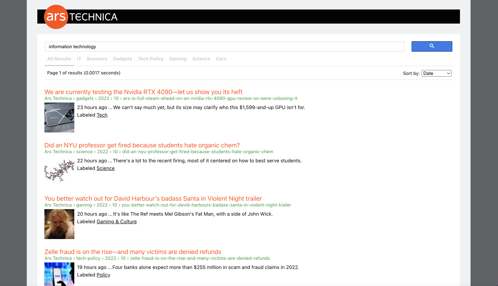

# Parse.ly Search
Ars Technica search utilizing the [Parse.ly Search API](https://www.parse.ly/help/api/search).

## Getting Started
`npm install` to install dependencies

`npm start` to get things running locally - go to [http://localhost:3000](http://localhost:3000) to view it in your browser.

## Running Tests
`npm test`
