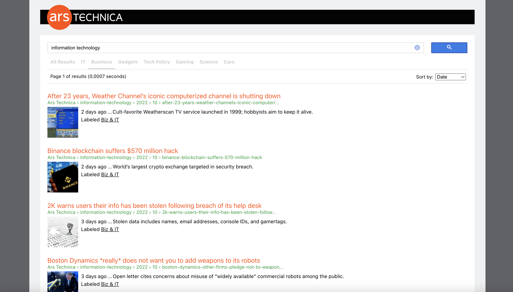

# Parse.ly Search
Ars Technica search utilizing the [Parse.ly Search API](https://www.parse.ly/help/api/search). Search includes sorting search results by relevance, date, and section, as well as pagination.

## Getting Started
`npm install` to install dependencies

`npm start` to get things running locally - go to [http://localhost:3000](http://localhost:3000) to view it in your browser.

## Running Tests
`npm test`

## Technologies Used
* [React](https://reactjs.org/)
* [React Testing Library](https://testing-library.com/docs/react-testing-library/intro/)
* [Axios](https://github.com/axios/axios)

## User Stories
* As a user, I want to be able to search for pages related to a search term that I input into the search box, so I can easily find relevant content.
* As a user, I want to be able to have an easier time finding the content I'm looking for by sorting search results by relevance, date, and section.
* As a user, I want to see enough information on a search result (title, date, description, thumbnail image, and label - if they all exist from the API response) so I know whether or not it's of interest to me.
* As a user, I want an indication of if a search result is from the last 24 hours, week, or if it's older, so I can easily identify newer content.
* As a user, I want more feedback in the search results so I know how relevant they are to my search term (by bolding the term I searched for in the search result title or description).
* As a user, I want to be able to know how much time it took for the results to load so I know whether or not the search is experiencing any technical issues or lagging.
* As a user, I want to see a loader when results are loading so I know whether or not the data has updated.
* As a user, I want to see an indication of if there are no search results or if there aren't any search results for a specific section, so I know whether or not I need to adjust my search term.
* As a user, I want to have access to my most recent searches in an autocomplete so I can easily select and run a previous search if I previously found useful content.
* As a user, I want to see what page of results I'm on as I page through them (by clicking on next or previous via the pagination), so I can keep track of how many pages I've viewed.
* As a user, I want the section and sort filters to reset when I run a new search, so I have a similar experience with the interface every time I conduct a search.
* As a user, I want the pagination to reset when I select a new filter or run a new search, so I can easily keep track of what page of the search results I'm viewing.
* As a user, I want to see all results within a specific section when I click on a search result's label link, so I have another option to sort through results. If the label exists within the section navigation, I want the item to have an active state in the navigation so I have an indication of what section I'm looking at. 

## Approach
When I started building out the application, my main focus was getting all the moving pieces working. This included the search, pagination, sort and section filters, formatting the text for the `SearchResultCard.js`, and general UI behavior. Next, I looked into breaking out pieces of logic to help keep the component files down to a reasonable size. For the section filters, I decided to hide them for mobile users, to simplify the UI experience on smaller devices. 

Most of the state/functional logic lives in the `SearchContext.js` and a lot of the search autocomplete logic lives within the `SearchBox.js` file. Helper files were created for calling the endpoint and then formatting the date/text from the response. 

I later looked into implementing Redux or utilizing the React Context API in order to have access to state updates globally (and not rely on local hooks that are being passed down via props). I decided on using React Context since it didn't require as much boilerplate code as Redux, which made sense since this application is fairly small.
